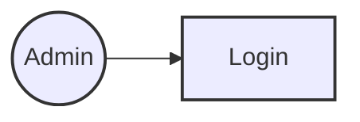
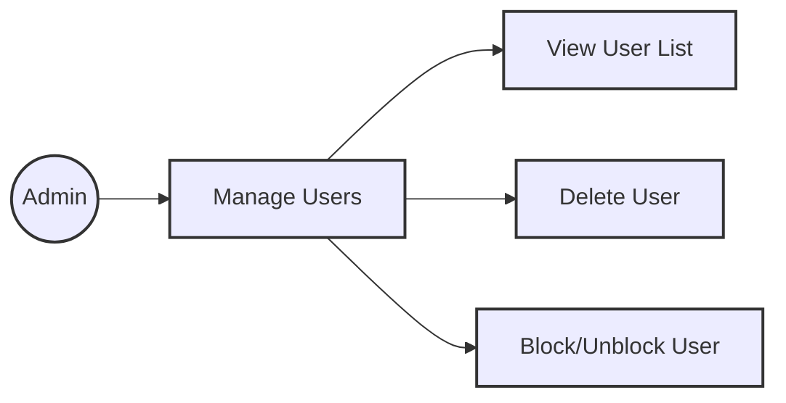
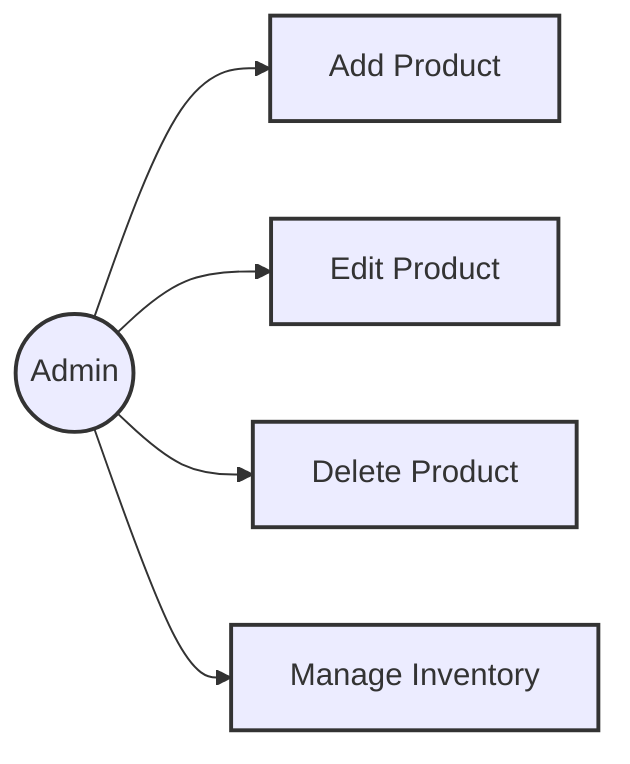
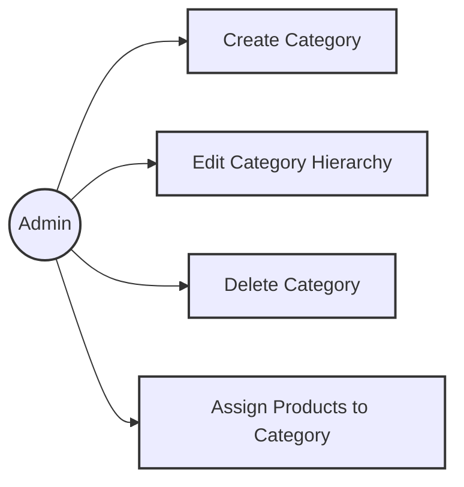
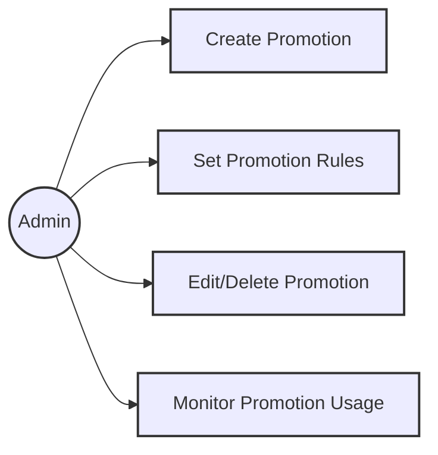
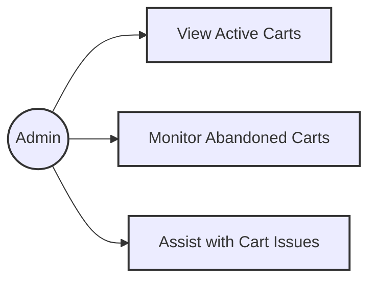
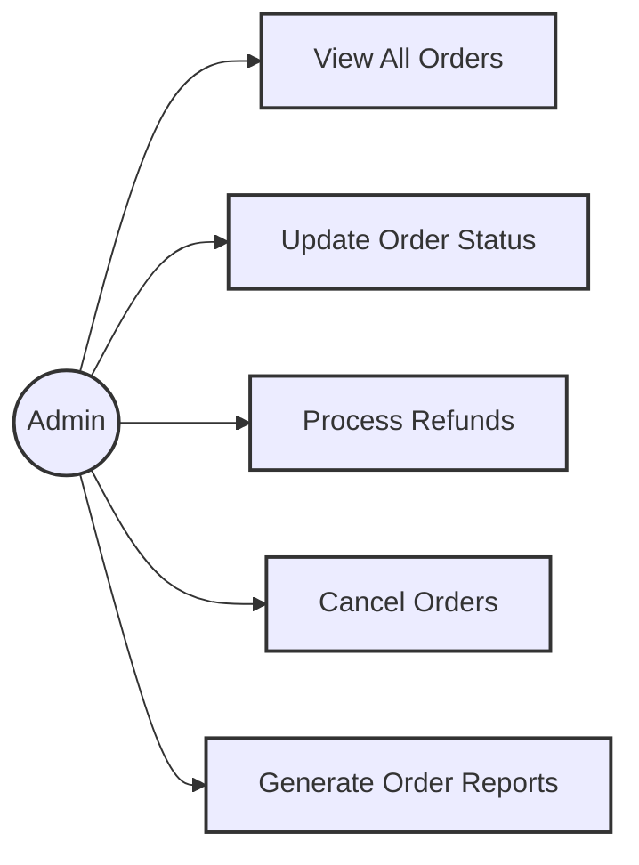
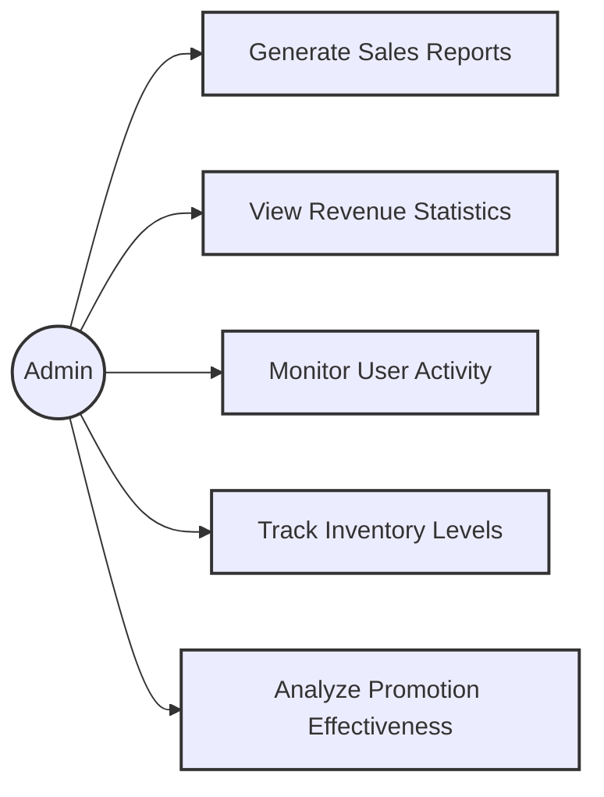

# Chức năng của phân hệ quản trị nội dung.

## Đăng nhập

### Sơ đồ Ca Sử dụng

### Chi tiết Ca Sử dụng

#### UC-1.1 Đăng nhập

| Mã số Ca Sử dụng  | UC-1.1                                                                         |
| ----------------- | ------------------------------------------------------------------------------ |
| **Tên Ca Sử dụng**| Đăng nhập                                                                      |
| **Mô tả**         | Là quản trị viên, tôi muốn đăng nhập vào ứng dụng để quản lý người dùng.       |
| **Tác nhân**      | Quản trị viên                                                                  |
| **Ưu tiên**       | Phải có                                                                        |
| **Kích hoạt**     | Quản trị viên muốn đăng nhập vào ứng dụng                                       |
| **Điều kiện tiên quyết** | - Tài khoản quản trị viên đã được tạo sẵn - Tài khoản quản trị viên đã được phân quyền - Thiết bị của quản trị viên đã được kết nối internet khi thực hiện đăng nhập |
| **Điều kiện sau** | - Quản trị viên đăng nhập ứng dụng thành công - Hệ thống ghi nhận hoạt động đăng nhập thành công vào Activity Log. |
| **Luồng chính**   | 1. Quản trị viên truy cập ứng dụng. 2. Quản trị viên nhập tài khoản và mật khẩu. 3. Quản trị viên chọn lệnh đăng nhập. 4. Hệ thống xác thực thông tin đăng nhập thành công và cho phép quản trị viên truy cập ứng dụng. 5. Hệ thống ghi nhận hoạt động đăng nhập thành công vào Activity Log. |
| **Luồng thay thế**| Không có |
| **Luồng ngoại lệ**| 4a. Hệ thống xác thực thông tin đăng nhập không thành công và hiển thị thông báo. 4a1. Quản trị viên chọn lệnh hủy đăng nhập. - Ca Sử dụng dừng lại. 4a2. Quản trị viên chọn lệnh lấy lại mật khẩu. - Ca Sử dụng tiếp tục Ca Sử dụng UC-2.3. |
| **Quy tắc nghiệp vụ** | - BR2.2-1: Quản trị viên nhập sai thông tin đăng nhập ở lần thứ 6 liên tiếp sẽ bị khóa tài khoản 30 phút. |
| **Yêu cầu phi chức năng** | - NFR2.2-1: Thời gian chờ cho màn hình đăng nhập dưới 60 giây. - NFR2.2-2: Mật khẩu của quản trị viên phải được hash bằng MD5. |
| **Phiên bản**     | v0.1.0 |

## Quản lý Người dùng

### Sơ đồ Ca Sử dụng

### Chi tiết Ca Sử dụng

#### UC-2.3 Quản lý người dùng

| Mã số Ca Sử dụng  | UC-2.3                                                                         |
| ----------------- | ------------------------------------------------------------------------------ |
| **Tên Ca Sử dụng**| Quản lý người dùng                                                             |
| **Mô tả**         | Là quản trị viên, tôi muốn quản lý người dùng để duy trì trật tự và bảo mật hệ thống. |
| **Tác nhân**      | Quản trị viên                                                                  |
| **Ưu tiên**       | Phải có                                                                        |
| **Kích hoạt**     | Quản trị viên muốn quản lý người dùng                                          |
| **Điều kiện tiên quyết** | - Quản trị viên đã đăng nhập vào hệ thống                                   |
| **Điều kiện sau** | - Quản trị viên quản lý người dùng thành công                              |
| **Luồng chính**   | 1. Quản trị viên truy cập ứng dụng. 2. Quản trị viên chọn lệnh quản lý người dùng. 3. Hệ thống hiển thị giao diện quản lý người dùng. |
| **Luồng thay thế**| Không có |
| **Luồng ngoại lệ**| Không có |
| **Quy tắc nghiệp vụ** | Không có |
| **Yêu cầu phi chức năng** | - NFR2.3-1: Thời gian tải giao diện quản lý người dùng dưới 2 giây. |
| **Phiên bản**     | v0.1.0 |

#### UC-2.4 Xem danh sách người dùng

| Mã số Ca Sử dụng  | UC-2.4                                                                         |
| ----------------- | ------------------------------------------------------------------------------ |
| **Tên Ca Sử dụng**| Xem danh sách người dùng                                                       |
| **Mô tả**         | Là quản trị viên, tôi muốn xem danh sách người dùng để theo dõi hoạt động của họ. |
| **Tác nhân**      | Quản trị viên                                                                  |
| **Ưu tiên**       | Phải có                                                                        |
| **Kích hoạt**     | Quản trị viên muốn xem danh sách người dùng                                    |
| **Điều kiện tiên quyết** | - Quản trị viên đã đăng nhập vào hệ thống                                   |
| **Điều kiện sau** | - Quản trị viên xem danh sách người dùng thành công                        |
| **Luồng chính**   | 1. Quản trị viên truy cập ứng dụng. 2. Quản trị viên chọn lệnh xem danh sách người dùng. 3. Hệ thống hiển thị danh sách người dùng. |
| **Luồng thay thế**| Không có |
| **Luồng ngoại lệ**| Không có |
| **Quy tắc nghiệp vụ** | Không có |
| **Yêu cầu phi chức năng** | - NFR2.4-1: Thời gian tải danh sách người dùng dưới 2 giây. |
| **Phiên bản**     | v0.1.0 |

#### UC-2.5 Xóa người dùng

| Mã số Ca Sử dụng  | UC-2.5                                                                         |
| ----------------- | ------------------------------------------------------------------------------ |
| **Tên Ca Sử dụng**| Xóa người dùng                                                                 |
| **Mô tả**         | Là quản trị viên, tôi muốn xóa người dùng để loại bỏ các tài khoản không hợp lệ. |
| **Tác nhân**      | Quản trị viên                                                                  |
| **Ưu tiên**       | Phải có                                                                        |
| **Kích hoạt**     | Quản trị viên muốn xóa người dùng                                              |
| **Điều kiện tiên quyết** | - Quản trị viên đã đăng nhập vào hệ thống                                   |
| **Điều kiện sau** | - Quản trị viên xóa người dùng thành công                                  |
| **Luồng chính**   | 1. Quản trị viên truy cập ứng dụng. 2. Quản trị viên chọn lệnh xóa người dùng. 3. Hệ thống hiển thị xác nhận xóa người dùng. 4. Quản trị viên xác nhận xóa. 5. Hệ thống xóa người dùng và cập nhật danh sách người dùng. |
| **Luồng thay thế**| Không có |
| **Luồng ngoại lệ**| Không có |
| **Quy tắc nghiệp vụ** | Không có |
| **Yêu cầu phi chức năng** | - NFR2.5-1: Thời gian xóa người dùng dưới 2 giây. |
| **Phiên bản**     | v0.1.0 |

#### UC-2.6 Khóa/Mở khóa người dùng

| Mã số Ca Sử dụng  | UC-2.6                                                                         |
| ----------------- | ------------------------------------------------------------------------------ |
| **Tên Ca Sử dụng**| Khóa/Mở khóa người dùng                                                        |
| **Mô tả**         | Là quản trị viên, tôi muốn khóa hoặc mở khóa người dùng để quản lý quyền truy cập của họ. |
| **Tác nhân**      | Quản trị viên                                                                  |
| **Ưu tiên**       | Phải có                                                                        |
| **Kích hoạt**     | Quản trị viên muốn khóa hoặc mở khóa người dùng                                |
| **Điều kiện tiên quyết** | - Quản trị viên đã đăng nhập vào hệ thống                                   |
| **Điều kiện sau** | - Quản trị viên khóa hoặc mở khóa người dùng thành công                    |
| **Luồng chính**   | 1. Quản trị viên truy cập ứng dụng. 2. Quản trị viên chọn lệnh khóa/mở khóa người dùng. 3. Hệ thống cập nhật trạng thái người dùng và hiển thị danh sách người dùng. |
| **Luồng thay thế**| Không có |
| **Luồng ngoại lệ**| Không có |
| **Quy tắc nghiệp vụ** | Không có |
| **Yêu cầu phi chức năng** | - NFR2.6-1: Thời gian cập nhật trạng thái người dùng dưới 2 giây. |
| **Phiên bản**     | v0.1.0 |

## Quản lý Sản phẩm

### Sơ đồ Ca Sử dụng

### Chi tiết Ca Sử dụng

#### UC-3.1 Thêm sản phẩm mới

| Mã số Ca Sử dụng  | UC-3.1                                                                         |
| ----------------- | ------------------------------------------------------------------------------ |
| **Tên Ca Sử dụng**| Thêm sản phẩm mới                                                              |
| **Mô tả**         | Là quản trị viên, tôi muốn thêm sản phẩm mới vào hệ thống.                     |
| **Tác nhân**      | Quản trị viên                                                                  |
| **Ưu tiên**       | Phải có                                                                        |
| **Kích hoạt**     | Quản trị viên muốn thêm sản phẩm mới                                           |
| **Điều kiện tiên quyết** | - Quản trị viên đã đăng nhập vào hệ thống                                   |
| **Điều kiện sau** | - Quản trị viên thêm sản phẩm mới thành công                                |
| **Luồng chính**   | 1. Quản trị viên truy cập ứng dụng. 2. Quản trị viên chọn lệnh thêm sản phẩm mới. 3. Hệ thống hiển thị giao diện thêm sản phẩm mới. 4. Quản trị viên nhập thông tin sản phẩm. 5. Quản trị viên chọn lệnh lưu. 6. Hệ thống lưu thông tin sản phẩm mới và hiển thị danh sách sản phẩm. |
| **Luồng thay thế**| Không có |
| **Luồng ngoại lệ**| Không có |
| **Quy tắc nghiệp vụ** | Không có |
| **Yêu cầu phi chức năng** | - NFR3.1-1: Thời gian lưu thông tin sản phẩm mới dưới 2 giây. |
| **Phiên bản**     | v0.1.0 |

#### UC-3.2 Chỉnh sửa chi tiết sản phẩm

| Mã số Ca Sử dụng  | UC-3.2                                                                         |
| ----------------- | ------------------------------------------------------------------------------ |
| **Tên Ca Sử dụng**| Chỉnh sửa chi tiết sản phẩm                                                    |
| **Mô tả**         | Là quản trị viên, tôi muốn chỉnh sửa chi tiết sản phẩm để cập nhật thông tin sản phẩm. |
| **Tác nhân**      | Quản trị viên                                                                  |
| **Ưu tiên**       | Phải có                                                                        |
| **Kích hoạt**     | Quản trị viên muốn chỉnh sửa chi tiết sản phẩm                                 |
| **Điều kiện tiên quyết** | - Quản trị viên đã đăng nhập vào hệ thống                                   |
| **Điều kiện sau** | - Quản trị viên chỉnh sửa chi tiết sản phẩm thành công                      |
| **Luồng chính**   | 1. Quản trị viên truy cập ứng dụng. 2. Quản trị viên chọn lệnh chỉnh sửa chi tiết sản phẩm. 3. Hệ thống hiển thị giao diện chỉnh sửa chi tiết sản phẩm. 4. Quản trị viên cập nhật thông tin sản phẩm. 5. Quản trị viên chọn lệnh lưu. 6. Hệ thống lưu thông tin cập nhật và hiển thị danh sách sản phẩm. |
| **Luồng thay thế**| Không có |
| **Luồng ngoại lệ**| Không có |
| **Quy tắc nghiệp vụ** | Không có |
| **Yêu cầu phi chức năng** | - NFR3.2-1: Thời gian lưu thông tin cập nhật dưới 2 giây. |
| **Phiên bản**     | v0.1.0 |

#### UC-3.3 Xóa sản phẩm

| Mã số Ca Sử dụng  | UC-3.3                                                                         |
| ----------------- | ------------------------------------------------------------------------------ |
| **Tên Ca Sử dụng**| Xóa sản phẩm                                                                   |
| **Mô tả**         | Là quản trị viên, tôi muốn xóa sản phẩm để loại bỏ các sản phẩm không hợp lệ.   |
| **Tác nhân**      | Quản trị viên                                                                  |
| **Ưu tiên**       | Phải có                                                                        |
| **Kích hoạt**     | Quản trị viên muốn xóa sản phẩm                                                |
| **Điều kiện tiên quyết** | - Quản trị viên đã đăng nhập vào hệ thống                                   |
| **Điều kiện sau** | - Quản trị viên xóa sản phẩm thành công                                     |
| **Luồng chính**   | 1. Quản trị viên truy cập ứng dụng. 2. Quản trị viên chọn lệnh xóa sản phẩm. 3. Hệ thống hiển thị xác nhận xóa sản phẩm. 4. Quản trị viên xác nhận xóa. 5. Hệ thống xóa sản phẩm và cập nhật danh sách sản phẩm. |
| **Luồng thay thế**| Không có |
| **Luồng ngoại lệ**| Không có |
| **Quy tắc nghiệp vụ** | Không có |
| **Yêu cầu phi chức năng** | - NFR3.3-1: Thời gian xóa sản phẩm dưới 2 giây. |
| **Phiên bản**     | v0.1.0 |

#### UC-3.4 Quản lý tồn kho sản phẩm

| Mã số Ca Sử dụng  | UC-3.4                                                                         |
| ----------------- | ------------------------------------------------------------------------------ |
| **Tên Ca Sử dụng**| Quản lý tồn kho sản phẩm                                                       |
| **Mô tả**         | Là quản trị viên, tôi muốn quản lý tồn kho sản phẩm để theo dõi và cập nhật số lượng sản phẩm. |
| **Tác nhân**      | Quản trị viên                                                                  |
| **Ưu tiên**       | Phải có                                                                        |
| **Kích hoạt**     | Quản trị viên muốn quản lý tồn kho sản phẩm                                    |
| **Điều kiện tiên quyết** | - Quản trị viên đã đăng nhập vào hệ thống                                   |
| **Điều kiện sau** | - Quản trị viên quản lý tồn kho sản phẩm thành công                         |
| **Luồng chính**   | 1. Quản trị viên truy cập ứng dụng. 2. Quản trị viên chọn lệnh quản lý tồn kho sản phẩm. 3. Hệ thống hiển thị giao diện quản lý tồn kho sản phẩm. 4. Quản trị viên cập nhật số lượng sản phẩm. 5. Quản trị viên chọn lệnh lưu. 6. Hệ thống lưu thông tin cập nhật và hiển thị danh sách sản phẩm. |
| **Luồng thay thế**| Không có |
| **Luồng ngoại lệ**| Không có |
| **Quy tắc nghiệp vụ** | Không có |
| **Yêu cầu phi chức năng** | - NFR3.4-1: Thời gian lưu thông tin cập nhật dưới 2 giây. |
| **Phiên bản**     | v0.1.0 |

## Quản lý Danh mục

### Sơ đồ Ca Sử dụng

### Chi tiết Ca Sử dụng

#### UC-4.1 Tạo danh mục mới

| Mã số Ca Sử dụng  | UC-4.1                                                                         |
| ----------------- | ------------------------------------------------------------------------------ |
| **Tên Ca Sử dụng**| Tạo danh mục mới                                                              |
| **Mô tả**         | Là quản trị viên, tôi muốn tạo danh mục mới để tổ chức sản phẩm.               |
| **Tác nhân**      | Quản trị viên                                                                  |
| **Ưu tiên**       | Phải có                                                                        |
| **Kích hoạt**     | Quản trị viên muốn tạo danh mục mới                                            |
| **Điều kiện tiên quyết** | - Quản trị viên đã đăng nhập vào hệ thống                                   |
| **Điều kiện sau** | - Quản trị viên tạo danh mục mới thành công                                 |
| **Luồng chính**   | 1. Quản trị viên truy cập ứng dụng. 2. Quản trị viên chọn lệnh tạo danh mục mới. 3. Hệ thống hiển thị giao diện tạo danh mục mới. 4. Quản trị viên nhập thông tin danh mục. 5. Quản trị viên chọn lệnh lưu. 6. Hệ thống lưu thông tin danh mục mới và hiển thị danh sách danh mục. |
| **Luồng thay thế**| Không có |
| **Luồng ngoại lệ**| Không có |
| **Quy tắc nghiệp vụ** | Không có |
| **Yêu cầu phi chức năng** | - NFR4.1-1: Thời gian lưu thông tin danh mục mới dưới 2 giây. |
| **Phiên bản**     | v0.1.0 |

#### UC-4.2 Chỉnh sửa cấu trúc danh mục

| Mã số Ca Sử dụng  | UC-4.2                                                                         |
| ----------------- | ------------------------------------------------------------------------------ |
| **Tên Ca Sử dụng**| Chỉnh sửa cấu trúc danh mục                                                    |
| **Mô tả**         | Là quản trị viên, tôi muốn chỉnh sửa cấu trúc danh mục để cập nhật thông tin danh mục. |
| **Tác nhân**      | Quản trị viên                                                                  |
| **Ưu tiên**       | Phải có                                                                        |
| **Kích hoạt**     | Quản trị viên muốn chỉnh sửa cấu trúc danh mục                                 |
| **Điều kiện tiên quyết** | - Quản trị viên đã đăng nhập vào hệ thống                                   |
| **Điều kiện sau** | - Quản trị viên chỉnh sửa cấu trúc danh mục thành công                      |
| **Luồng chính**   | 1. Quản trị viên truy cập ứng dụng. 2. Quản trị viên chọn lệnh chỉnh sửa cấu trúc danh mục. 3. Hệ thống hiển thị giao diện chỉnh sửa cấu trúc danh mục. 4. Quản trị viên cập nhật thông tin danh mục. 5. Quản trị viên chọn lệnh lưu. 6. Hệ thống lưu thông tin cập nhật và hiển thị danh sách danh mục. |
| **Luồng thay thế**| Không có |
| **Luồng ngoại lệ**| Không có |
| **Quy tắc nghiệp vụ** | Không có |
| **Yêu cầu phi chức năng** | - NFR4.2-1: Thời gian lưu thông tin cập nhật dưới 2 giây. |
| **Phiên bản**     | v0.1.0 |

#### UC-4.3 Xóa danh mục

| Mã số Ca Sử dụng  | UC-4.3                                                                         |
| ----------------- | ------------------------------------------------------------------------------ |
| **Tên Ca Sử dụng**| Xóa danh mục                                                                   |
| **Mô tả**         | Là quản trị viên, tôi muốn xóa danh mục để loại bỏ các danh mục không hợp lệ.   |
| **Tác nhân**      | Quản trị viên                                                                  |
| **Ưu tiên**       | Phải có                                                                        |
| **Kích hoạt**     | Quản trị viên muốn xóa danh mục                                                |
| **Điều kiện tiên quyết** | - Quản trị viên đã đăng nhập vào hệ thống                                   |
| **Điều kiện sau** | - Quản trị viên xóa danh mục thành công                                     |
| **Luồng chính**   | 1. Quản trị viên truy cập ứng dụng. 2. Quản trị viên chọn lệnh xóa danh mục. 3. Hệ thống hiển thị xác nhận xóa danh mục. 4. Quản trị viên xác nhận xóa. 5. Hệ thống xóa danh mục và cập nhật danh sách danh mục. |
| **Luồng thay thế**| Không có |
| **Luồng ngoại lệ**| Không có |
| **Quy tắc nghiệp vụ** | Không có |
| **Yêu cầu phi chức năng** | - NFR4.3-1: Thời gian xóa danh mục dưới 2 giây. |
| **Phiên bản**     | v0.1.0 |

#### UC-4.4 Gán sản phẩm vào danh mục

| Mã số Ca Sử dụng  | UC-4.4                                                                         |
| ----------------- | ------------------------------------------------------------------------------ |
| **Tên Ca Sử dụng**| Gán sản phẩm vào danh mục                                                      |
| **Mô tả**         | Là quản trị viên, tôi muốn gán sản phẩm vào danh mục để tổ chức sản phẩm.       |
| **Tác nhân**      | Quản trị viên                                                                  |
| **Ưu tiên**       | Phải có                                                                        |
| **Kích hoạt**     | Quản trị viên muốn gán sản phẩm vào danh mục                                    |
| **Điều kiện tiên quyết** | - Quản trị viên đã đăng nhập vào hệ thống                                   |
| **Điều kiện sau** | - Quản trị viên gán sản phẩm vào danh mục thành công                         |
| **Luồng chính**   | 1. Quản trị viên truy cập ứng dụng. 2. Quản trị viên chọn lệnh gán sản phẩm vào danh mục. 3. Hệ thống hiển thị giao diện gán sản phẩm vào danh mục. 4. Quản trị viên chọn sản phẩm và danh mục. 5. Quản trị viên chọn lệnh lưu. 6. Hệ thống lưu thông tin cập nhật và hiển thị danh sách sản phẩm trong danh mục. |
| **Luồng thay thế**| Không có |
| **Luồng ngoại lệ**| Không có |
| **Quy tắc nghiệp vụ** | Không có |
| **Yêu cầu phi chức năng** | - NFR4.4-1: Thời gian lưu thông tin cập nhật dưới 2 giây. |
| **Phiên bản**     | v0.1.0 |

## Quản lý Khuyến mãi

### Sơ đồ Ca Sử dụng

### Chi tiết Ca Sử dụng

#### UC-5.1 Tạo khuyến mãi mới

| Mã số Ca Sử dụng  | UC-5.1                                                                         |
| ----------------- | ------------------------------------------------------------------------------ |
| **Tên Ca Sử dụng**| Tạo khuyến mãi mới                                                             |
| **Mô tả**         | Là quản trị viên, tôi muốn tạo khuyến mãi mới để thu hút khách hàng.           |
| **Tác nhân**      | Quản trị viên                                                                  |
| **Ưu tiên**       | Phải có                                                                        |
| **Kích hoạt**     | Quản trị viên muốn tạo khuyến mãi mới                                          |
| **Điều kiện tiên quyết** | - Quản trị viên đã đăng nhập vào hệ thống                                   |
| **Điều kiện sau** | - Quản trị viên tạo khuyến mãi mới thành công                                |
| **Luồng chính**   | 1. Quản trị viên truy cập ứng dụng. 2. Quản trị viên chọn lệnh tạo khuyến mãi mới. 3. Hệ thống hiển thị giao diện tạo khuyến mãi mới. 4. Quản trị viên nhập thông tin khuyến mãi. 5. Quản trị viên chọn lệnh lưu. 6. Hệ thống lưu thông tin khuyến mãi mới và hiển thị danh sách khuyến mãi. |
| **Luồng thay thế**| Không có |
| **Luồng ngoại lệ**| Không có |
| **Quy tắc nghiệp vụ** | Không có |
| **Yêu cầu phi chức năng** | - NFR5.1-1: Thời gian lưu thông tin khuyến mãi mới dưới 2 giây. |
| **Phiên bản**     | v0.1.0 |

#### UC-5.2 Đặt quy tắc khuyến mãi

| Mã số Ca Sử dụng  | UC-5.2                                                                         |
| ----------------- | ------------------------------------------------------------------------------ |
| **Tên Ca Sử dụng**| Đặt quy tắc khuyến mãi                                                         |
| **Mô tả**         | Là quản trị viên, tôi muốn đặt quy tắc khuyến mãi để xác định điều kiện áp dụng khuyến mãi. |
| **Tác nhân**      | Quản trị viên                                                                  |
| **Ưu tiên**       | Phải có                                                                        |
| **Kích hoạt**     | Quản trị viên muốn đặt quy tắc khuyến mãi                                      |
| **Điều kiện tiên quyết** | - Quản trị viên đã đăng nhập vào hệ thống                                   |
| **Điều kiện sau** | - Quản trị viên đặt quy tắc khuyến mãi thành công                            |
| **Luồng chính**   | 1. Quản trị viên truy cập ứng dụng. 2. Quản trị viên chọn lệnh đặt quy tắc khuyến mãi. 3. Hệ thống hiển thị giao diện đặt quy tắc khuyến mãi. 4. Quản trị viên nhập thông tin quy tắc khuyến mãi. 5. Quản trị viên chọn lệnh lưu. 6. Hệ thống lưu thông tin quy tắc khuyến mãi và hiển thị danh sách khuyến mãi. |
| **Luồng thay thế**| Không có |
| **Luồng ngoại lệ**| Không có |
| **Quy tắc nghiệp vụ** | Không có |
| **Yêu cầu phi chức năng** | - NFR5.2-1: Thời gian lưu thông tin quy tắc khuyến mãi dưới 2 giây. |
| **Phiên bản**     | v0.1.0 |

#### UC-5.3 Chỉnh sửa/Xóa khuyến mãi

| Mã số Ca Sử dụng  | UC-5.3                                                                         |
| ----------------- | ------------------------------------------------------------------------------ |
| **Tên Ca Sử dụng**| Chỉnh sửa/Xóa khuyến mãi                                                       |
| **Mô tả**         | Là quản trị viên, tôi muốn chỉnh sửa hoặc xóa khuyến mãi để cập nhật hoặc loại bỏ các khuyến mãi không hợp lệ. |
| **Tác nhân**      | Quản trị viên                                                                  |
| **Ưu tiên**       | Phải có                                                                        |
| **Kích hoạt**     | Quản trị viên muốn chỉnh sửa hoặc xóa khuyến mãi                                |
| **Điều kiện tiên quyết** | - Quản trị viên đã đăng nhập vào hệ thống                                   |
| **Điều kiện sau** | - Quản trị viên chỉnh sửa hoặc xóa khuyến mãi thành công                     |
| **Luồng chính**   | 1. Quản trị viên truy cập ứng dụng. 2. Quản trị viên chọn lệnh chỉnh sửa hoặc xóa khuyến mãi. 3. Hệ thống hiển thị giao diện chỉnh sửa hoặc xác nhận xóa khuyến mãi. 4. Quản trị viên cập nhật thông tin hoặc xác nhận xóa. 5. Hệ thống lưu thông tin cập nhật hoặc xóa khuyến mãi và hiển thị danh sách khuyến mãi. |
| **Luồng thay thế**| Không có |
| **Luồng ngoại lệ**| Không có |
| **Quy tắc nghiệp vụ** | Không có |
| **Yêu cầu phi chức năng** | - NFR5.3-1: Thời gian lưu thông tin cập nhật hoặc xóa khuyến mãi dưới 2 giây. |
| **Phiên bản**     | v0.1.0 |

#### UC-5.4 Giám sát sử dụng khuyến mãi

| Mã số Ca Sử dụng  | UC-5.4                                                                         |
| ----------------- | ------------------------------------------------------------------------------ |
| **Tên Ca Sử dụng**| Giám sát sử dụng khuyến mãi                                                    |
| **Mô tả**         | Là quản trị viên, tôi muốn giám sát sử dụng khuyến mãi để theo dõi hiệu quả của các khuyến mãi. |
| **Tác nhân**      | Quản trị viên                                                                  |
| **Ưu tiên**       | Phải có                                                                        |
| **Kích hoạt**     | Quản trị viên muốn giám sát sử dụng khuyến mãi                                  |
| **Điều kiện tiên quyết** | - Quản trị viên đã đăng nhập vào hệ thống                                   |
| **Điều kiện sau** | - Quản trị viên giám sát sử dụng khuyến mãi thành công                       |
| **Luồng chính**   | 1. Quản trị viên truy cập ứng dụng. 2. Quản trị viên chọn lệnh giám sát sử dụng khuyến mãi. 3. Hệ thống hiển thị giao diện giám sát sử dụng khuyến mãi. 4. Quản trị viên theo dõi thông tin khuyến mãi. |
| **Luồng thay thế**| Không có |
| **Luồng ngoại lệ**| Không có |
| **Quy tắc nghiệp vụ** | Không có |
| **Yêu cầu phi chức năng** | - NFR5.4-1: Thời gian tải thông tin giám sát dưới 2 giây. |
| **Phiên bản**     | v0.1.0 |

## Quản lý Giỏ hàng

### Sơ đồ Ca Sử dụng

### Chi tiết Ca Sử dụng

#### UC-6.1 Xem giỏ hàng đang hoạt động

| Mã số Ca Sử dụng  | UC-6.1                                                                         |
| ----------------- | ------------------------------------------------------------------------------ |
| **Tên Ca Sử dụng**| Xem giỏ hàng đang hoạt động                                                    |
| **Mô tả**         | Là quản trị viên, tôi muốn xem giỏ hàng đang hoạt động để theo dõi các giao dịch hiện tại. |
| **Tác nhân**      | Quản trị viên                                                                  |
| **Ưu tiên**       | Phải có                                                                        |
| **Kích hoạt**     | Quản trị viên muốn xem giỏ hàng đang hoạt động                                 |
| **Điều kiện tiên quyết** | - Quản trị viên đã đăng nhập vào hệ thống                                   |
| **Điều kiện sau** | - Quản trị viên xem giỏ hàng đang hoạt động thành công                       |
| **Luồng chính**   | 1. Quản trị viên truy cập ứng dụng. 2. Quản trị viên chọn lệnh xem giỏ hàng đang hoạt động. 3. Hệ thống hiển thị danh sách giỏ hàng đang hoạt động. |
| **Luồng thay thế**| Không có |
| **Luồng ngoại lệ**| Không có |
| **Quy tắc nghiệp vụ** | Không có |
| **Yêu cầu phi chức năng** | - NFR6.1-1: Thời gian tải danh sách giỏ hàng dưới 2 giây. |
| **Phiên bản**     | v0.1.0 |

#### UC-6.2 Giám sát giỏ hàng bị bỏ rơi

| Mã số Ca Sử dụng  | UC-6.2                                                                         |
| ----------------- | ------------------------------------------------------------------------------ |
| **Tên Ca Sử dụng**| Giám sát giỏ hàng bị bỏ rơi                                                    |
| **Mô tả**         | Là quản trị viên, tôi muốn giám sát giỏ hàng bị bỏ rơi để theo dõi và khắc phục các vấn đề. |
| **Tác nhân**      | Quản trị viên                                                                  |
| **Ưu tiên**       | Phải có                                                                        |
| **Kích hoạt**     | Quản trị viên muốn giám sát giỏ hàng bị bỏ rơi                                 |
| **Điều kiện tiên quyết** | - Quản trị viên đã đăng nhập vào hệ thống                                   |
| **Điều kiện sau** | - Quản trị viên giám sát giỏ hàng bị bỏ rơi thành công                       |
| **Luồng chính**   | 1. Quản trị viên truy cập ứng dụng. 2. Quản trị viên chọn lệnh giám sát giỏ hàng bị bỏ rơi. 3. Hệ thống hiển thị danh sách giỏ hàng bị bỏ rơi. |
| **Luồng thay thế**| Không có |
| **Luồng ngoại lệ**| Không có |
| **Quy tắc nghiệp vụ** | Không có |
| **Yêu cầu phi chức năng** | - NFR6.2-1: Thời gian tải danh sách giỏ hàng bị bỏ rơi dưới 2 giây. |
| **Phiên bản**     | v0.1.0 |

#### UC-6.3 Hỗ trợ vấn đề giỏ hàng

| Mã số Ca Sử dụng  | UC-6.3                                                                         |
| ----------------- | ------------------------------------------------------------------------------ |
| **Tên Ca Sử dụng**| Hỗ trợ vấn đề giỏ hàng                                                         |
| **Mô tả**         | Là quản trị viên, tôi muốn hỗ trợ các vấn đề giỏ hàng để giải quyết các vấn đề của khách hàng. |
| **Tác nhân**      | Quản trị viên                                                                  |
| **Ưu tiên**       | Phải có                                                                        |
| **Kích hoạt**     | Quản trị viên muốn hỗ trợ các vấn đề giỏ hàng                                  |
| **Điều kiện tiên quyết** | - Quản trị viên đã đăng nhập vào hệ thống                                   |
| **Điều kiện sau** | - Quản trị viên hỗ trợ các vấn đề giỏ hàng thành công                        |
| **Luồng chính**   | 1. Quản trị viên truy cập ứng dụng. 2. Quản trị viên chọn lệnh hỗ trợ các vấn đề giỏ hàng. 3. Hệ thống hiển thị danh sách các vấn đề giỏ hàng. 4. Quản trị viên giải quyết các vấn đề. |
| **Luồng thay thế**| Không có |
| **Luồng ngoại lệ**| Không có |
| **Quy tắc nghiệp vụ** | Không có |
| **Yêu cầu phi chức năng** | - NFR6.3-1: Thời gian tải danh sách các vấn đề giỏ hàng dưới 2 giây. |
| **Phiên bản**     | v0.1.0 |

## Quản lý Đơn hàng

### Sơ đồ Ca Sử dụng

### Chi tiết Ca Sử dụng

#### UC-7.1 Xem tất cả đơn hàng

| Mã số Ca Sử dụng  | UC-7.1                                                                         |
| ----------------- | ------------------------------------------------------------------------------ |
| **Tên Ca Sử dụng**| Xem tất cả đơn hàng                                                            |
| **Mô tả**         | Là quản trị viên, tôi muốn xem tất cả đơn hàng để theo dõi các giao dịch.       |
| **Tác nhân**      | Quản trị viên                                                                  |
| **Ưu tiên**       | Phải có                                                                        |
| **Kích hoạt**     | Quản trị viên muốn xem tất cả đơn hàng                                         |
| **Điều kiện tiên quyết** | - Quản trị viên đã đăng nhập vào hệ thống                                   |
| **Điều kiện sau** | - Quản trị viên xem tất cả đơn hàng thành công                               |
| **Luồng chính**   | 1. Quản trị viên truy cập ứng dụng. 2. Quản trị viên chọn lệnh xem tất cả đơn hàng. 3. Hệ thống hiển thị danh sách tất cả đơn hàng. |
| **Luồng thay thế**| Không có |
| **Luồng ngoại lệ**| Không có |
| **Quy tắc nghiệp vụ** | Không có |
| **Yêu cầu phi chức năng** | - NFR7.1-1: Thời gian tải danh sách đơn hàng dưới 2 giây. |
| **Phiên bản**     | v0.1.0 |

#### UC-7.2 Cập nhật trạng thái đơn hàng

| Mã số Ca Sử dụng  | UC-7.2                                                                         |
| ----------------- | ------------------------------------------------------------------------------ |
| **Tên Ca Sử dụng**| Cập nhật trạng thái đơn hàng                                                   |
| **Mô tả**         | Là quản trị viên, tôi muốn cập nhật trạng thái đơn hàng để theo dõi tiến trình giao hàng. |
| **Tác nhân**      | Quản trị viên                                                                  |
| **Ưu tiên**       | Phải có                                                                        |
| **Kích hoạt**     | Quản trị viên muốn cập nhật trạng thái đơn hàng                                |
| **Điều kiện tiên quyết** | - Quản trị viên đã đăng nhập vào hệ thống                                   |
| **Điều kiện sau** | - Quản trị viên cập nhật trạng thái đơn hàng thành công                      |
| **Luồng chính**   | 1. Quản trị viên truy cập ứng dụng. 2. Quản trị viên chọn lệnh cập nhật trạng thái đơn hàng. 3. Hệ thống hiển thị giao diện cập nhật trạng thái đơn hàng. 4. Quản trị viên cập nhật trạng thái đơn hàng. 5. Quản trị viên chọn lệnh lưu. 6. Hệ thống lưu thông tin cập nhật và hiển thị danh sách đơn hàng. |
| **Luồng thay thế**| Không có |
| **Luồng ngoại lệ**| Không có |
| **Quy tắc nghiệp vụ** | Không có |
| **Yêu cầu phi chức năng** | - NFR7.2-1: Thời gian lưu thông tin cập nhật dưới 2 giây. |
| **Phiên bản**     | v0.1.0 |

#### UC-7.3 Xử lý hoàn tiền

| Mã số Ca Sử dụng  | UC-7.3                                                                         |
| ----------------- | ------------------------------------------------------------------------------ |
| **Tên Ca Sử dụng**| Xử lý hoàn tiền                                                                |
| **Mô tả**         | Là quản trị viên, tôi muốn xử lý hoàn tiền để giải quyết các yêu cầu hoàn tiền của khách hàng. |
| **Tác nhân**      | Quản trị viên                                                                  |
| **Ưu tiên**       | Phải có                                                                        |
| **Kích hoạt**     | Quản trị viên muốn xử lý hoàn tiền                                              |
| **Điều kiện tiên quyết** | - Quản trị viên đã đăng nhập vào hệ thống                                   |
| **Điều kiện sau** | - Quản trị viên xử lý hoàn tiền thành công                                    |
| **Luồng chính**   | 1. Quản trị viên truy cập ứng dụng. 2. Quản trị viên chọn lệnh xử lý hoàn tiền. 3. Hệ thống hiển thị giao diện xử lý hoàn tiền. 4. Quản trị viên xác nhận hoàn tiền. 5. Hệ thống xử lý hoàn tiền và cập nhật danh sách đơn hàng. |
| **Luồng thay thế**| Không có |
| **Luồng ngoại lệ**| Không có |
| **Quy tắc nghiệp vụ** | Không có |
| **Yêu cầu phi chức năng** | - NFR7.3-1: Thời gian xử lý hoàn tiền dưới 2 giây. |
| **Phiên bản**     | v0.1.0 |

#### UC-7.4 Hủy đơn hàng

| Mã số Ca Sử dụng  | UC-7.4                                                                         |
| ----------------- | ------------------------------------------------------------------------------ |
| **Tên Ca Sử dụng**| Hủy đơn hàng                                                                   |
| **Mô tả**         | Là quản trị viên, tôi muốn hủy đơn hàng để giải quyết các yêu cầu hủy đơn hàng của khách hàng. |
| **Tác nhân**      | Quản trị viên                                                                  |
| **Ưu tiên**       | Phải có                                                                        |
| **Kích hoạt**     | Quản trị viên muốn hủy đơn hàng                                                |
| **Điều kiện tiên quyết** | - Quản trị viên đã đăng nhập vào hệ thống                                   |
| **Điều kiện sau** | - Quản trị viên hủy đơn hàng thành công                                      |
| **Luồng chính**   | 1. Quản trị viên truy cập ứng dụng. 2. Quản trị viên chọn lệnh hủy đơn hàng. 3. Hệ thống hiển thị giao diện hủy đơn hàng. 4. Quản trị viên xác nhận hủy đơn hàng. 5. Hệ thống hủy đơn hàng và cập nhật danh sách đơn hàng. |
| **Luồng thay thế**| Không có |
| **Luồng ngoại lệ**| Không có |
| **Quy tắc nghiệp vụ** | Không có |
| **Yêu cầu phi chức năng** | - NFR7.4-1: Thời gian hủy đơn hàng dưới 2 giây. |
| **Phiên bản**     | v0.1.0 |

#### UC-7.5 Tạo báo cáo đơn hàng

| Mã số Ca Sử dụng  | UC-7.5                                                                         |
| ----------------- | ------------------------------------------------------------------------------ |
| **Tên Ca Sử dụng**| Tạo báo cáo đơn hàng                                                           |
| **Mô tả**         | Là quản trị viên, tôi muốn tạo báo cáo đơn hàng để theo dõi và phân tích các giao dịch. |
| **Tác nhân**      | Quản trị viên                                                                  |
| **Ưu tiên**       | Phải có                                                                        |
| **Kích hoạt**     | Quản trị viên muốn tạo báo cáo đơn hàng                                         |
| **Điều kiện tiên quyết** | - Quản trị viên đã đăng nhập vào hệ thống                                   |
| **Điều kiện sau** | - Quản trị viên tạo báo cáo đơn hàng thành công                               |
| **Luồng chính**   | 1. Quản trị viên truy cập ứng dụng. 2. Quản trị viên chọn lệnh tạo báo cáo đơn hàng. 3. Hệ thống hiển thị giao diện tạo báo cáo đơn hàng. 4. Quản trị viên nhập thông tin báo cáo. 5. Quản trị viên chọn lệnh tạo báo cáo. 6. Hệ thống tạo báo cáo và hiển thị danh sách báo cáo. |
| **Luồng thay thế**| Không có |
| **Luồng ngoại lệ**| Không có |
| **Quy tắc nghiệp vụ** | Không có |
| **Yêu cầu phi chức năng** | - NFR7.5-1: Thời gian tạo báo cáo dưới 2 giây. |
| **Phiên bản**     | v0.1.0 |

## Báo cáo

### Sơ đồ Ca Sử dụng

### Chi tiết Ca Sử dụng

#### UC-8.1 Tạo báo cáo bán hàng

| Mã số Ca Sử dụng  | UC-8.1                                                                         |
| ----------------- | ------------------------------------------------------------------------------ |
| **Tên Ca Sử dụng**| Tạo báo cáo bán hàng                                                           |
| **Mô tả**         | Là quản trị viên, tôi muốn tạo báo cáo bán hàng để theo dõi doanh số.           |
| **Tác nhân**      | Quản trị viên                                                                  |
| **Ưu tiên**       | Phải có                                                                        |
| **Kích hoạt**     | Quản trị viên muốn tạo báo cáo bán hàng                                         |
| **Điều kiện tiên quyết** | - Quản trị viên đã đăng nhập vào hệ thống                                   |
| **Điều kiện sau** | - Quản trị viên tạo báo cáo bán hàng thành công                               |
| **Luồng chính**   | 1. Quản trị viên truy cập ứng dụng. 2. Quản trị viên chọn lệnh tạo báo cáo bán hàng. 3. Hệ thống hiển thị giao diện tạo báo cáo bán hàng. 4. Quản trị viên nhập thông tin báo cáo. 5. Quản trị viên chọn lệnh tạo báo cáo. 6. Hệ thống tạo báo cáo và hiển thị danh sách báo cáo. |
| **Luồng thay thế**| Không có |
| **Luồng ngoại lệ**| Không có |
| **Quy tắc nghiệp vụ** | Không có |
| **Yêu cầu phi chức năng** | - NFR8.1-1: Thời gian tạo báo cáo dưới 2 giây. |
| **Phiên bản**     | v0.1.0 |

#### UC-8.2 Xem thống kê doanh thu

| Mã số Ca Sử dụng  | UC-8.2                                                                         |
| ----------------- | ------------------------------------------------------------------------------ |
| **Tên Ca Sử dụng**| Xem thống kê doanh thu                                                         |
| **Mô tả**         | Là quản trị viên, tôi muốn xem thống kê doanh thu để theo dõi tình hình tài chính. |
| **Tác nhân**      | Quản trị viên                                                                  |
| **Ưu tiên**       | Phải có                                                                        |
| **Kích hoạt**     | Quản trị viên muốn xem thống kê doanh thu                                      |
| **Điều kiện tiên quyết** | - Quản trị viên đã đăng nhập vào hệ thống                                   |
| **Điều kiện sau** | - Quản trị viên xem thống kê doanh thu thành công                            |
| **Luồng chính**   | 1. Quản trị viên truy cập ứng dụng. 2. Quản trị viên chọn lệnh xem thống kê doanh thu. 3. Hệ thống hiển thị giao diện thống kê doanh thu. |
| **Luồng thay thế**| Không có |
| **Luồng ngoại lệ**| Không có |
| **Quy tắc nghiệp vụ** | Không có |
| **Yêu cầu phi chức năng** | - NFR8.2-1: Thời gian tải thống kê doanh thu dưới 2 giây. |
| **Phiên bản**     | v0.1.0 |

#### UC-8.3 Giám sát hoạt động người dùng

| Mã số Ca Sử dụng  | UC-8.3                                                                         |
| ----------------- | ------------------------------------------------------------------------------ |
| **Tên Ca Sử dụng**| Giám sát hoạt động người dùng                                                  |
| **Mô tả**         | Là quản trị viên, tôi muốn giám sát hoạt động người dùng để theo dõi hành vi của họ. |
| **Tác nhân**      | Quản trị viên                                                                  |
| **Ưu tiên**       | Phải có                                                                        |
| **Kích hoạt**     | Quản trị viên muốn giám sát hoạt động người dùng                                |
| **Điều kiện tiên quyết** | - Quản trị viên đã đăng nhập vào hệ thống                                   |
| **Điều kiện sau** | - Quản trị viên giám sát hoạt động người dùng thành công                      |
| **Luồng chính**   | 1. Quản trị viên truy cập ứng dụng. 2. Quản trị viên chọn lệnh giám sát hoạt động người dùng. 3. Hệ thống hiển thị giao diện giám sát hoạt động người dùng. |
| **Luồng thay thế**| Không có |
| **Luồng ngoại lệ**| Không có |
| **Quy tắc nghiệp vụ** | Không có |
| **Yêu cầu phi chức năng** | - NFR8.3-1: Thời gian tải thông tin giám sát dưới 2 giây. |
| **Phiên bản**     | v0.1.0 |

#### UC-8.4 Theo dõi mức tồn kho

| Mã số Ca Sử dụng  | UC-8.4                                                                         |
| ----------------- | ------------------------------------------------------------------------------ |
| **Tên Ca Sử dụng**| Theo dõi mức tồn kho                                                           |
| **Mô tả**         | Là quản trị viên, tôi muốn theo dõi mức tồn kho để quản lý số lượng sản phẩm.   |
| **Tác nhân**      | Quản trị viên                                                                  |
| **Ưu tiên**       | Phải có                                                                        |
| **Kích hoạt**     | Quản trị viên muốn theo dõi mức tồn kho                                         |
| **Điều kiện tiên quyết** | - Quản trị viên đã đăng nhập vào hệ thống                                   |
| **Điều kiện sau** | - Quản trị viên theo dõi mức tồn kho thành công                               |
| **Luồng chính**   | 1. Quản trị viên truy cập ứng dụng. 2. Quản trị viên chọn lệnh theo dõi mức tồn kho. 3. Hệ thống hiển thị giao diện theo dõi mức tồn kho. |
| **Luồng thay thế**| Không có |
| **Luồng ngoại lệ**| Không có |
| **Quy tắc nghiệp vụ** | Không có |
| **Yêu cầu phi chức năng** | - NFR8.4-1: Thời gian tải thông tin tồn kho dưới 2 giây. |
| **Phiên bản**     | v0.1.0 |

#### UC-8.5 Phân tích hiệu quả khuyến mãi

| Mã số Ca Sử dụng  | UC-8.5                                                                         |
| ----------------- | ------------------------------------------------------------------------------ |
| **Tên Ca Sử dụng**| Phân tích hiệu quả khuyến mãi                                                  |
| **Mô tả**         | Là quản trị viên, tôi muốn phân tích hiệu quả khuyến mãi để đánh giá tác động của các chương trình khuyến mãi. |
| **Tác nhân**      | Quản trị viên                                                                  |
| **Ưu tiên**       | Phải có                                                                        |
| **Kích hoạt**     | Quản trị viên muốn phân tích hiệu quả khuyến mãi                                |
| **Điều kiện tiên quyết** | - Quản trị viên đã đăng nhập vào hệ thống                                   |
| **Điều kiện sau** | - Quản trị viên phân tích hiệu quả khuyến mãi thành công                      |
| **Luồng chính**   | 1. Quản trị viên truy cập ứng dụng. 2. Quản trị viên chọn lệnh phân tích hiệu quả khuyến mãi. 3. Hệ thống hiển thị giao diện phân tích hiệu quả khuyến mãi. |
| **Luồng thay thế**| Không có |
| **Luồng ngoại lệ**| Không có |
| **Quy tắc nghiệp vụ** | Không có |
| **Yêu cầu phi chức năng** | - NFR8.5-1: Thời gian tải thông tin phân tích dưới 2 giây. |
| **Phiên bản**     | v0.1.0 |
