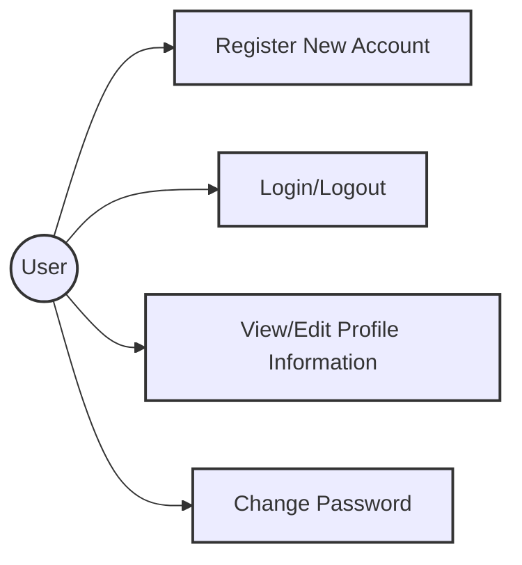
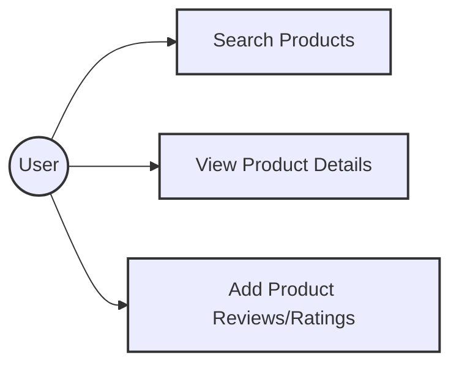
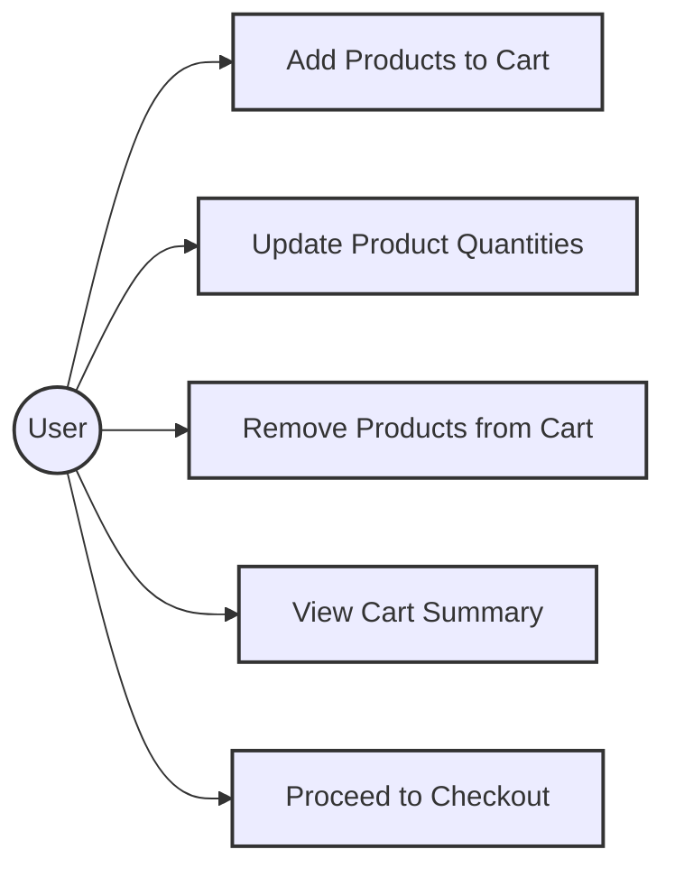
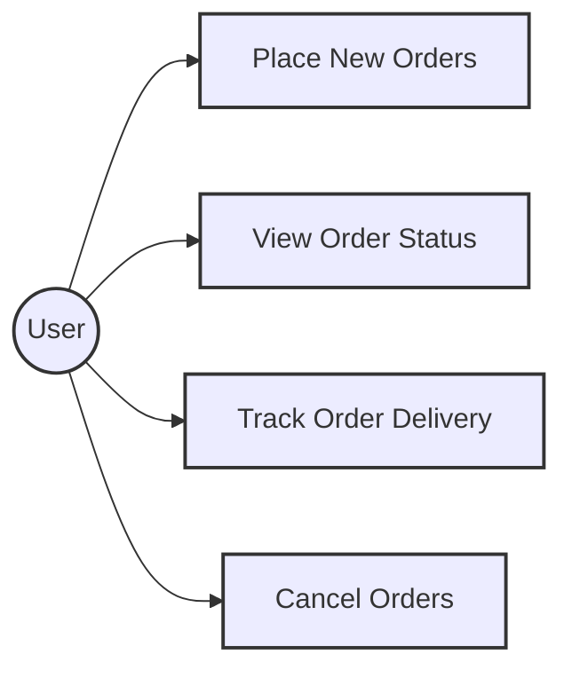
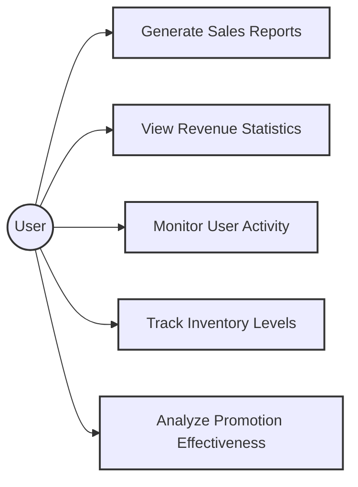

# Chức năng của người dùng bình thường

## Quản lý Người dùng

### Sơ đồ Ca Sử dụng

### Chi tiết Ca Sử dụng

#### UC-1.1 Đăng ký tài khoản mới

| Mã số Ca Sử dụng  | UC-1.1                                                                         |
| ----------------- | ------------------------------------------------------------------------------ |
| **Tên Ca Sử dụng**| Đăng ký tài khoản mới                                                          |
| **Mô tả**         | Là người dùng, tôi muốn đăng ký tài khoản mới để sử dụng các dịch vụ của hệ thống. |
| **Tác nhân**      | Người dùng                                                                     |
| **Ưu tiên**       | Phải có                                                                        |
| **Kích hoạt**     | Người dùng muốn đăng ký tài khoản mới                                          |
| **Điều kiện tiên quyết** | Không có                                                                  |
| **Điều kiện sau** | - Người dùng đăng ký tài khoản mới thành công                                 |
| **Luồng chính**   | 1. Người dùng truy cập ứng dụng. 2. Người dùng chọn lệnh đăng ký tài khoản mới. 3. Hệ thống hiển thị giao diện đăng ký tài khoản mới. 4. Người dùng nhập thông tin tài khoản. 5. Người dùng chọn lệnh đăng ký. 6. Hệ thống lưu thông tin tài khoản mới và hiển thị thông báo đăng ký thành công. |
| **Luồng thay thế**| Không có |
| **Luồng ngoại lệ**| Không có |
| **Quy tắc nghiệp vụ** | Không có |
| **Yêu cầu phi chức năng** | - NFR1.1-1: Thời gian đăng ký tài khoản mới dưới 2 giây. |
| **Phiên bản**     | v0.1.0 |

#### UC-1.2 Đăng nhập/Đăng xuất

| Mã số Ca Sử dụng  | UC-1.2                                                                         |
| ----------------- | ------------------------------------------------------------------------------ |
| **Tên Ca Sử dụng**| Đăng nhập/Đăng xuất                                                            |
| **Mô tả**         | Là người dùng, tôi muốn đăng nhập và đăng xuất để sử dụng và thoát khỏi hệ thống. |
| **Tác nhân**      | Người dùng                                                                     |
| **Ưu tiên**       | Phải có                                                                        |
| **Kích hoạt**     | Người dùng muốn đăng nhập hoặc đăng xuất                                       |
| **Điều kiện tiên quyết** | - Người dùng đã có tài khoản                                               |
| **Điều kiện sau** | - Người dùng đăng nhập hoặc đăng xuất thành công                              |
| **Luồng chính**   | 1. Người dùng truy cập ứng dụng. 2. Người dùng chọn lệnh đăng nhập hoặc đăng xuất. 3. Hệ thống hiển thị giao diện đăng nhập hoặc đăng xuất. 4. Người dùng nhập thông tin đăng nhập hoặc xác nhận đăng xuất. 5. Hệ thống xác thực thông tin và thực hiện đăng nhập hoặc đăng xuất. |
| **Luồng thay thế**| Không có |
| **Luồng ngoại lệ**| Không có |
| **Quy tắc nghiệp vụ** | Không có |
| **Yêu cầu phi chức năng** | - NFR1.2-1: Thời gian đăng nhập hoặc đăng xuất dưới 2 giây. |
| **Phiên bản**     | v0.1.0 |

#### UC-1.3 Xem/Chỉnh sửa thông tin cá nhân

| Mã số Ca Sử dụng  | UC-1.3                                                                         |
| ----------------- | ------------------------------------------------------------------------------ |
| **Tên Ca Sử dụng**| Xem/Chỉnh sửa thông tin cá nhân                                                |
| **Mô tả**         | Là người dùng, tôi muốn xem và chỉnh sửa thông tin cá nhân để cập nhật thông tin của mình. |
| **Tác nhân**      | Người dùng                                                                     |
| **Ưu tiên**       | Phải có                                                                        |
| **Kích hoạt**     | Người dùng muốn xem hoặc chỉnh sửa thông tin cá nhân                           |
| **Điều kiện tiên quyết** | - Người dùng đã đăng nhập vào hệ thống                                   |
| **Điều kiện sau** | - Người dùng xem hoặc chỉnh sửa thông tin cá nhân thành công                  |
| **Luồng chính**   | 1. Người dùng truy cập ứng dụng. 2. Người dùng chọn lệnh xem hoặc chỉnh sửa thông tin cá nhân. 3. Hệ thống hiển thị giao diện xem hoặc chỉnh sửa thông tin cá nhân. 4. Người dùng cập nhật thông tin cá nhân. 5. Người dùng chọn lệnh lưu. 6. Hệ thống lưu thông tin cập nhật và hiển thị thông báo thành công. |
| **Luồng thay thế**| Không có |
| **Luồng ngoại lệ**| Không có |
| **Quy tắc nghiệp vụ** | Không có |
| **Yêu cầu phi chức năng** | - NFR1.3-1: Thời gian lưu thông tin cập nhật dưới 2 giây. |
| **Phiên bản**     | v0.1.0 |

#### UC-1.4 Đổi mật khẩu

| Mã số Ca Sử dụng  | UC-1.4                                                                         |
| ----------------- | ------------------------------------------------------------------------------ |
| **Tên Ca Sử dụng**| Đổi mật khẩu                                                                   |
| **Mô tả**         | Là người dùng, tôi muốn đổi mật khẩu để bảo mật tài khoản của mình.             |
| **Tác nhân**      | Người dùng                                                                     |
| **Ưu tiên**       | Phải có                                                                        |
| **Kích hoạt**     | Người dùng muốn đổi mật khẩu                                                   |
| **Điều kiện tiên quyết** | - Người dùng đã đăng nhập vào hệ thống                                   |
| **Điều kiện sau** | - Người dùng đổi mật khẩu thành công                                          |
| **Luồng chính**   | 1. Người dùng truy cập ứng dụng. 2. Người dùng chọn lệnh đổi mật khẩu. 3. Hệ thống hiển thị giao diện đổi mật khẩu. 4. Người dùng nhập mật khẩu cũ và mật khẩu mới. 5. Người dùng chọn lệnh lưu. 6. Hệ thống lưu thông tin mật khẩu mới và hiển thị thông báo thành công. |
| **Luồng thay thế**| Không có |
| **Luồng ngoại lệ**| Không có |
| **Quy tắc nghiệp vụ** | Không có |
| **Yêu cầu phi chức năng** | - NFR1.4-1: Thời gian đổi mật khẩu dưới 2 giây. |
| **Phiên bản**     | v0.1.0 |

## Quản lý Sản phẩm

### Sơ đồ Ca Sử dụng

### Chi tiết Ca Sử dụng

#### UC-2.1 Tìm kiếm sản phẩm

| Mã số Ca Sử dụng  | UC-2.1                                                                         |
| ----------------- | ------------------------------------------------------------------------------ |
| **Tên Ca Sử dụng**| Tìm kiếm sản phẩm                                                              |
| **Mô tả**         | Là người dùng, tôi muốn tìm kiếm sản phẩm theo tên, danh mục hoặc bộ lọc để tìm sản phẩm phù hợp. |
| **Tác nhân**      | Người dùng                                                                     |
| **Ưu tiên**       | Phải có                                                                        |
| **Kích hoạt**     | Người dùng muốn tìm kiếm sản phẩm                                              |
| **Điều kiện tiên quyết** | Không có                                                                  |
| **Điều kiện sau** | - Người dùng tìm kiếm sản phẩm thành công                                     |
| **Luồng chính**   | 1. Người dùng truy cập ứng dụng. 2. Người dùng chọn lệnh tìm kiếm sản phẩm. 3. Hệ thống hiển thị giao diện tìm kiếm sản phẩm. 4. Người dùng nhập tên, chọn danh mục hoặc áp dụng bộ lọc sản phẩm. 5. Người dùng chọn lệnh tìm kiếm. 6. Hệ thống hiển thị danh sách sản phẩm tìm kiếm được. |
| **Luồng thay thế**| Không có |
| **Luồng ngoại lệ**| Không có |
| **Quy tắc nghiệp vụ** | Không có |
| **Yêu cầu phi chức năng** | - NFR2.1-1: Thời gian tìm kiếm sản phẩm dưới 2 giây. |
| **Phiên bản**     | v0.1.0 |

#### UC-2.2 Xem chi tiết sản phẩm

| Mã số Ca Sử dụng  | UC-2.2                                                                         |
| ----------------- | ------------------------------------------------------------------------------ |
| **Tên Ca Sử dụng**| Xem chi tiết sản phẩm                                                          |
| **Mô tả**         | Là người dùng, tôi muốn xem chi tiết sản phẩm để biết thêm thông tin về sản phẩm. |
| **Tác nhân**      | Người dùng                                                                     |
| **Ưu tiên**       | Phải có                                                                        |
| **Kích hoạt**     | Người dùng muốn xem chi tiết sản phẩm                                          |
| **Điều kiện tiên quyết** | Không có                                                                  |
| **Điều kiện sau** | - Người dùng xem chi tiết sản phẩm thành công                                 |
| **Luồng chính**   | 1. Người dùng truy cập ứng dụng. 2. Người dùng chọn lệnh xem chi tiết sản phẩm. 3. Hệ thống hiển thị giao diện chi tiết sản phẩm. |
| **Luồng thay thế**| Không có |
| **Luồng ngoại lệ**| Không có |
| **Quy tắc nghiệp vụ** | Không có |
| **Yêu cầu phi chức năng** | - NFR2.2-1: Thời gian tải chi tiết sản phẩm dưới 2 giây. |
| **Phiên bản**     | v0.1.0 |

#### UC-2.3 Thêm đánh giá/xếp hạng sản phẩm

| Mã số Ca Sử dụng  | UC-2.3                                                                         |
| ----------------- | ------------------------------------------------------------------------------ |
| **Tên Ca Sử dụng**| Thêm đánh giá/xếp hạng sản phẩm                                                |
| **Mô tả**         | Là người dùng, tôi muốn thêm đánh giá và xếp hạng sản phẩm để chia sẻ ý kiến của mình. |
| **Tác nhân**      | Người dùng                                                                     |
| **Ưu tiên**       | Phải có                                                                        |
| **Kích hoạt**     | Người dùng muốn thêm đánh giá và xếp hạng sản phẩm                             |
| **Điều kiện tiên quyết** | - Người dùng đã đăng nhập vào hệ thống                                   |
| **Điều kiện sau** | - Người dùng thêm đánh giá và xếp hạng sản phẩm thành công                    |
| **Luồng chính**   | 1. Người dùng truy cập ứng dụng. 2. Người dùng chọn lệnh thêm đánh giá/xếp hạng sản phẩm. 3. Hệ thống hiển thị giao diện thêm đánh giá/xếp hạng sản phẩm. 4. Người dùng nhập đánh giá và xếp hạng sản phẩm. 5. Người dùng chọn lệnh lưu. 6. Hệ thống lưu thông tin đánh giá/xếp hạng và hiển thị thông báo thành công. |
| **Luồng thay thế**| Không có |
| **Luồng ngoại lệ**| Không có |
| **Quy tắc nghiệp vụ** | Không có |
| **Yêu cầu phi chức năng** | - NFR2.3-1: Thời gian lưu thông tin đánh giá/xếp hạng dưới 2 giây. |
| **Phiên bản**     | v0.2.0 |

## Quản lý Giỏ hàng

### Sơ đồ Ca Sử dụng

### Chi tiết Ca Sử dụng

#### UC-3.1 Thêm sản phẩm vào giỏ hàng

| Mã số Ca Sử dụng  | UC-3.1                                                                         |
| ----------------- | ------------------------------------------------------------------------------ |
| **Tên Ca Sử dụng**| Thêm sản phẩm vào giỏ hàng                                                     |
| **Mô tả**         | Là người dùng, tôi muốn thêm sản phẩm vào giỏ hàng để mua sắm.                 |
| **Tác nhân**      | Người dùng                                                                     |
| **Ưu tiên**       | Phải có                                                                        |
| **Kích hoạt**     | Người dùng muốn thêm sản phẩm vào giỏ hàng                                     |
| **Điều kiện tiên quyết** | Không có                                                                  |
| **Điều kiện sau** | - Người dùng thêm sản phẩm vào giỏ hàng thành công                            |
| **Luồng chính**   | 1. Người dùng truy cập ứng dụng. 2. Người dùng chọn sản phẩm. 3. Người dùng chọn lệnh thêm vào giỏ hàng. 4. Hệ thống thêm sản phẩm vào giỏ hàng và hiển thị thông báo thành công. |
| **Luồng thay thế**| Không có |
| **Luồng ngoại lệ**| Không có |
| **Quy tắc nghiệp vụ** | Không có |
| **Yêu cầu phi chức năng** | - NFR3.1-1: Thời gian thêm sản phẩm vào giỏ hàng dưới 2 giây. |
| **Phiên bản**     | v0.1.0 |

#### UC-3.2 Cập nhật số lượng sản phẩm

| Mã số Ca Sử dụng  | UC-3.2                                                                         |
| ----------------- | ------------------------------------------------------------------------------ |
| **Tên Ca Sử dụng**| Cập nhật số lượng sản phẩm                                                     |
| **Mô tả**         | Là người dùng, tôi muốn cập nhật số lượng sản phẩm trong giỏ hàng để điều chỉnh đơn hàng. |
| **Tác nhân**      | Người dùng                                                                     |
| **Ưu tiên**       | Phải có                                                                        |
| **Kích hoạt**     | Người dùng muốn cập nhật số lượng sản phẩm                                     |
| **Điều kiện tiên quyết** | Không có                                                                  |
| **Điều kiện sau** | - Người dùng cập nhật số lượng sản phẩm thành công                            |
| **Luồng chính**   | 1. Người dùng truy cập ứng dụng. 2. Người dùng chọn giỏ hàng. 3. Người dùng cập nhật số lượng sản phẩm. 4. Hệ thống cập nhật số lượng sản phẩm và hiển thị thông báo thành công. |
| **Luồng thay thế**| Không có |
| **Luồng ngoại lệ**| Không có |
| **Quy tắc nghiệp vụ** | Không có |
| **Yêu cầu phi chức năng** | - NFR3.2-1: Thời gian cập nhật số lượng sản phẩm dưới 2 giây. |
| **Phiên bản**     | v0.1.0 |

#### UC-3.3 Xóa sản phẩm khỏi giỏ hàng

| Mã số Ca Sử dụng  | UC-3.3                                                                         |
| ----------------- | ------------------------------------------------------------------------------ |
| **Tên Ca Sử dụng**| Xóa sản phẩm khỏi giỏ hàng                                                     |
| **Mô tả**         | Là người dùng, tôi muốn xóa sản phẩm khỏi giỏ hàng để điều chỉnh đơn hàng.     |
| **Tác nhân**      | Người dùng                                                                     |
| **Ưu tiên**       | Phải có                                                                        |
| **Kích hoạt**     | Người dùng muốn xóa sản phẩm khỏi giỏ hàng                                     |
| **Điều kiện tiên quyết** | Không có                                                                  |
| **Điều kiện sau** | - Người dùng xóa sản phẩm khỏi giỏ hàng thành công                            |
| **Luồng chính**   | 1. Người dùng truy cập ứng dụng. 2. Người dùng chọn giỏ hàng. 3. Người dùng chọn lệnh xóa sản phẩm. 4. Hệ thống xóa sản phẩm khỏi giỏ hàng và hiển thị thông báo thành công. |
| **Luồng thay thế**| Không có |
| **Luồng ngoại lệ**| Không có |
| **Quy tắc nghiệp vụ** | Không có |
| **Yêu cầu phi chức năng** | - NFR3.3-1: Thời gian xóa sản phẩm khỏi giỏ hàng dưới 2 giây. |
| **Phiên bản**     | v0.1.0 |

#### UC-3.4 Xem tóm tắt giỏ hàng

| Mã số Ca Sử dụng  | UC-3.4                                                                         |
| ----------------- | ------------------------------------------------------------------------------ |
| **Tên Ca Sử dụng**| Xem tóm tắt giỏ hàng                                                           |
| **Mô tả**         | Là người dùng, tôi muốn xem tóm tắt giỏ hàng để kiểm tra các sản phẩm đã chọn. |
| **Tác nhân**      | Người dùng                                                                     |
| **Ưu tiên**       | Phải có                                                                        |
| **Kích hoạt**     | Người dùng muốn xem tóm tắt giỏ hàng                                           |
| **Điều kiện tiên quyết** | Không có                                                                  |
| **Điều kiện sau** | - Người dùng xem tóm tắt giỏ hàng thành công                                  |
| **Luồng chính**   | 1. Người dùng truy cập ứng dụng. 2. Người dùng chọn giỏ hàng. 3. Hệ thống hiển thị tóm tắt giỏ hàng. |
| **Luồng thay thế**| Không có |
| **Luồng ngoại lệ**| Không có |
| **Quy tắc nghiệp vụ** | Không có |
| **Yêu cầu phi chức năng** | - NFR3.4-1: Thời gian tải tóm tắt giỏ hàng dưới 2 giây. |
| **Phiên bản**     | v0.1.0 |

#### UC-3.5 Tiến hành thanh toán

| Mã số Ca Sử dụng  | UC-3.5                                                                         |
| ----------------- | ------------------------------------------------------------------------------ |
| **Tên Ca Sử dụng**| Tiến hành thanh toán                                                           |
| **Mô tả**         | Là người dùng, tôi muốn tiến hành thanh toán để hoàn tất đơn hàng.             |
| **Tác nhân**      | Người dùng                                                                     |
| **Ưu tiên**       | Phải có                                                                        |
| **Kích hoạt**     | Người dùng muốn tiến hành thanh toán                                           |
| **Điều kiện tiên quyết** | Không có                                                                  |
| **Điều kiện sau** | - Người dùng tiến hành thanh toán thành công                                  |
| **Luồng chính**   | 1. Người dùng truy cập ứng dụng. 2. Người dùng chọn giỏ hàng. 3. Người dùng chọn lệnh thanh toán. 4. Hệ thống hiển thị giao diện thanh toán. 5. Người dùng nhập thông tin thanh toán. 6. Người dùng chọn lệnh xác nhận. 7. Hệ thống xử lý thanh toán và hiển thị thông báo thành công. |
| **Luồng thay thế**| Không có |
| **Luồng ngoại lệ**| Không có |
| **Quy tắc nghiệp vụ** | Không có |
| **Yêu cầu phi chức năng** | - NFR3.5-1: Thời gian xử lý thanh toán dưới 2 giây. |
| **Phiên bản**     | v0.1.0 |

## Quản lý Đơn hàng

### Sơ đồ Ca Sử dụng

### Chi tiết Ca Sử dụng

#### UC-4.1 Đặt đơn hàng mới

| Mã số Ca Sử dụng  | UC-4.1                                                                         |
| ----------------- | ------------------------------------------------------------------------------ |
| **Tên Ca Sử dụng**| Đặt đơn hàng mới                                                               |
| **Mô tả**         | Là người dùng, tôi muốn đặt đơn hàng mới để mua sản phẩm.                      |
| **Tác nhân**      | Người dùng                                                                     |
| **Ưu tiên**       | Phải có                                                                        |
| **Kích hoạt**     | Người dùng muốn đặt đơn hàng mới                                               |
| **Điều kiện tiên quyết** | Không có                                                                  |
| **Điều kiện sau** | - Người dùng đặt đơn hàng mới thành công                                      |
| **Luồng chính**   | 1. Người dùng truy cập ứng dụng. 2. Người dùng chọn sản phẩm. 3. Người dùng chọn lệnh đặt hàng. 4. Hệ thống hiển thị giao diện đặt hàng. 5. Người dùng nhập thông tin đặt hàng. 6. Người dùng chọn lệnh xác nhận. 7. Hệ thống xử lý đơn hàng và hiển thị thông báo thành công. |
| **Luồng thay thế**| Không có |
| **Luồng ngoại lệ**| Không có |
| **Quy tắc nghiệp vụ** | Không có |
| **Yêu cầu phi chức năng** | - NFR4.1-1: Thời gian xử lý đơn hàng dưới 2 giây. |
| **Phiên bản**     | v0.1.0 |

#### UC-4.2 Xem trạng thái đơn hàng

| Mã số Ca Sử dụng  | UC-4.2                                                                         |
| ----------------- | ------------------------------------------------------------------------------ |
| **Tên Ca Sử dụng**| Xem trạng thái đơn hàng                                                        |
| **Mô tả**         | Là người dùng, tôi muốn xem trạng thái đơn hàng để theo dõi tiến trình giao hàng. |
| **Tác nhân**      | Người dùng                                                                     |
| **Ưu tiên**       | Phải có                                                                        |
| **Kích hoạt**     | Người dùng muốn xem trạng thái đơn hàng                                        |
| **Điều kiện tiên quyết** | Không có                                                                  |
| **Điều kiện sau** | - Người dùng xem trạng thái đơn hàng thành công                               |
| **Luồng chính**   | 1. Người dùng truy cập ứng dụng. 2. Người dùng chọn lệnh xem trạng thái đơn hàng. 3. Hệ thống hiển thị trạng thái đơn hàng. |
| **Luồng thay thế**| Không có |
| **Luồng ngoại lệ**| Không có |
| **Quy tắc nghiệp vụ** | Không có |
| **Yêu cầu phi chức năng** | - NFR4.2-1: Thời gian tải trạng thái đơn hàng dưới 2 giây. |
| **Phiên bản**     | v0.1.0 |

#### UC-4.3 Theo dõi giao hàng

| Mã số Ca Sử dụng  | UC-4.3                                                                         |
| ----------------- | ------------------------------------------------------------------------------ |
| **Tên Ca Sử dụng**| Theo dõi giao hàng                                                             |
| **Mô tả**         | Là người dùng, tôi muốn theo dõi giao hàng để biết khi nào đơn hàng sẽ đến.    |
| **Tác nhân**      | Người dùng                                                                     |
| **Ưu tiên**       | Phải có                                                                        |
| **Kích hoạt**     | Người dùng muốn theo dõi giao hàng                                             |
| **Điều kiện tiên quyết** | Không có                                                                  |
| **Điều kiện sau** | - Người dùng theo dõi giao hàng thành công                                    |
| **Luồng chính**   | 1. Người dùng truy cập ứng dụng. 2. Người dùng chọn lệnh theo dõi giao hàng. 3. Hệ thống hiển thị thông tin giao hàng. |
| **Luồng thay thế**| Không có |
| **Luồng ngoại lệ**| Không có |
| **Quy tắc nghiệp vụ** | Không có |
| **Yêu cầu phi chức năng** | - NFR4.3-1: Thời gian tải thông tin giao hàng dưới 2 giây. |
| **Phiên bản**     | v0.2.0 |

#### UC-4.4 Hủy đơn hàng

| Mã số Ca Sử dụng  | UC-4.4                                                                         |
| ----------------- | ------------------------------------------------------------------------------ |
| **Tên Ca Sử dụng**| Hủy đơn hàng                                                                   |
| **Mô tả**         | Là người dùng, tôi muốn hủy đơn hàng để điều chỉnh đơn hàng.                   |
| **Tác nhân**      | Người dùng                                                                     |
| **Ưu tiên**       | Phải có                                                                        |
| **Kích hoạt**     | Người dùng muốn hủy đơn hàng                                                   |
| **Điều kiện tiên quyết** | Không có                                                                  |
| **Điều kiện sau** | - Người dùng hủy đơn hàng thành công                                          |
| **Luồng chính**   | 1. Người dùng truy cập ứng dụng. 2. Người dùng chọn lệnh hủy đơn hàng. 3. Hệ thống hiển thị xác nhận hủy đơn hàng. 4. Người dùng xác nhận hủy đơn hàng. 5. Hệ thống hủy đơn hàng và hiển thị thông báo thành công. |
| **Luồng thay thế**| Không có |
| **Luồng ngoại lệ**| Không có |
| **Quy tắc nghiệp vụ** | Không có |
| **Yêu cầu phi chức năng** | - NFR4.4-1: Thời gian hủy đơn hàng dưới 2 giây. |
| **Phiên bản**     | v0.2.0 |

## Báo cáo

### Sơ đồ Ca Sử dụng

### Chi tiết Ca Sử dụng

#### UC-5.1 Tạo báo cáo bán hàng

| Mã số Ca Sử dụng  | UC-5.1                                                                         |
| ----------------- | ------------------------------------------------------------------------------ |
| **Tên Ca Sử dụng**| Tạo báo cáo bán hàng                                                           |
| **Mô tả**         | Là người dùng, tôi muốn tạo báo cáo bán hàng để theo dõi doanh số.             |
| **Tác nhân**      | Người dùng                                                                     |
| **Ưu tiên**       | Phải có                                                                        |
| **Kích hoạt**     | Người dùng muốn tạo báo cáo bán hàng                                           |
| **Điều kiện tiên quyết** | - Người dùng đã đăng nhập vào hệ thống                                   |
| **Điều kiện sau** | - Người dùng tạo báo cáo bán hàng thành công                                  |
| **Luồng chính**   | 1. Người dùng truy cập ứng dụng. 2. Người dùng chọn lệnh tạo báo cáo bán hàng. 3. Hệ thống hiển thị giao diện tạo báo cáo bán hàng. 4. Người dùng nhập thông tin báo cáo. 5. Người dùng chọn lệnh tạo báo cáo. 6. Hệ thống tạo báo cáo và hiển thị danh sách báo cáo. |
| **Luồng thay thế**| Không có |
| **Luồng ngoại lệ**| Không có |
| **Quy tắc nghiệp vụ** | Không có |
| **Yêu cầu phi chức năng** | - NFR5.1-1: Thời gian tạo báo cáo dưới 2 giây. |
| **Phiên bản**     | v0.2.0 |

#### UC-5.2 Xem thống kê doanh thu

| Mã số Ca Sử dụng  | UC-5.2                                                                         |
| ----------------- | ------------------------------------------------------------------------------ |
| **Tên Ca Sử dụng**| Xem thống kê doanh thu                                                         |
| **Mô tả**         | Là người dùng, tôi muốn xem thống kê doanh thu để theo dõi tình hình tài chính. |
| **Tác nhân**      | Người dùng                                                                     |
| **Ưu tiên**       | Phải có                                                                        |
| **Kích hoạt**     | Người dùng muốn xem thống kê doanh thu                                         |
| **Điều kiện tiên quyết** | - Người dùng đã đăng nhập vào hệ thống                                   |
| **Điều kiện sau** | - Người dùng xem thống kê doanh thu thành công                                |
| **Luồng chính**   | 1. Người dùng truy cập ứng dụng. 2. Người dùng chọn lệnh xem thống kê doanh thu. 3. Hệ thống hiển thị giao diện thống kê doanh thu. |
| **Luồng thay thế**| Không có |
| **Luồng ngoại lệ**| Không có |
| **Quy tắc nghiệp vụ** | Không có |
| **Yêu cầu phi chức năng** | - NFR5.2-1: Thời gian tải thống kê doanh thu dưới 2 giây. |
| **Phiên bản**     | v0.2.0 |

#### UC-5.3 Giám sát hoạt động người dùng

| Mã số Ca Sử dụng  | UC-5.3                                                                         |
| ----------------- | ------------------------------------------------------------------------------ |
| **Tên Ca Sử dụng**| Giám sát hoạt động người dùng                                                  |
| **Mô tả**         | Là người dùng, tôi muốn giám sát hoạt động người dùng để theo dõi hành vi của họ. |
| **Tác nhân**      | Người dùng                                                                     |
| **Ưu tiên**       | Phải có                                                                        |
| **Kích hoạt**     | Người dùng muốn giám sát hoạt động người dùng                                  |
| **Điều kiện tiên quyết** | - Người dùng đã đăng nhập vào hệ thống                                   |
| **Điều kiện sau** | - Người dùng giám sát hoạt động người dùng thành công                         |
| **Luồng chính**   | 1. Người dùng truy cập ứng dụng. 2. Người dùng chọn lệnh giám sát hoạt động người dùng. 3. Hệ thống hiển thị giao diện giám sát hoạt động người dùng. |
| **Luồng thay thế**| Không có |
| **Luồng ngoại lệ**| Không có |
| **Quy tắc nghiệp vụ** | Không có |
| **Yêu cầu phi chức năng** | - NFR5.3-1: Thời gian tải thông tin giám sát dưới 2 giây. |
| **Phiên bản**     | v0.2.0 |

#### UC-5.4 Theo dõi mức tồn kho

| Mã số Ca Sử dụng  | UC-5.4                                                                         |
| ----------------- | ------------------------------------------------------------------------------ |
| **Tên Ca Sử dụng**| Theo dõi mức tồn kho                                                           |
| **Mô tả**         | Là người dùng, tôi muốn theo dõi mức tồn kho để quản lý số lượng sản phẩm.     |
| **Tác nhân**      | Người dùng                                                                     |
| **Ưu tiên**       | Phải có                                                                        |
| **Kích hoạt**     | Người dùng muốn theo dõi mức tồn kho                                           |
| **Điều kiện tiên quyết** | - Người dùng đã đăng nhập vào hệ thống                                   |
| **Điều kiện sau** | - Người dùng theo dõi mức tồn kho thành công                                  |
| **Luồng chính**   | 1. Người dùng truy cập ứng dụng. 2. Người dùng chọn lệnh theo dõi mức tồn kho. 3. Hệ thống hiển thị giao diện theo dõi mức tồn kho. |
| **Luồng thay thế**| Không có |
| **Luồng ngoại lệ**| Không có |
| **Quy tắc nghiệp vụ** | Không có |
| **Yêu cầu phi chức năng** | - NFR5.4-1: Thời gian tải thông tin tồn kho dưới 2 giây. |
| **Phiên bản**     | v0.2.0 |

#### UC-5.5 Phân tích hiệu quả khuyến mãi

| Mã số Ca Sử dụng  | UC-5.5                                                                         |
| ----------------- | ------------------------------------------------------------------------------ |
| **Tên Ca Sử dụng**| Phân tích hiệu quả khuyến mãi                                                  |
| **Mô tả**         | Là người dùng, tôi muốn phân tích hiệu quả khuyến mãi để đánh giá tác động của các chương trình khuyến mãi. |
| **Tác nhân**      | Người dùng                                                                     |
| **Ưu tiên**       | Phải có                                                                        |
| **Kích hoạt**     | Người dùng muốn phân tích hiệu quả khuyến mãi                                  |
| **Điều kiện tiên quyết** | - Người dùng đã đăng nhập vào hệ thống                                   |
| **Điều kiện sau** | - Người dùng phân tích hiệu quả khuyến mãi thành công                         |
| **Luồng chính**   | 1. Người dùng truy cập ứng dụng. 2. Người dùng chọn lệnh phân tích hiệu quả khuyến mãi. 3. Hệ thống hiển thị giao diện phân tích hiệu quả khuyến mãi. |
| **Luồng thay thế**| Không có |
| **Luồng ngoại lệ**| Không có |
| **Quy tắc nghiệp vụ** | Không có |
| **Yêu cầu phi chức năng** | - NFR5.5-1: Thời gian tải thông tin phân tích dưới 2 giây. |
| **Phiên bản**     | v0.2.0 |
