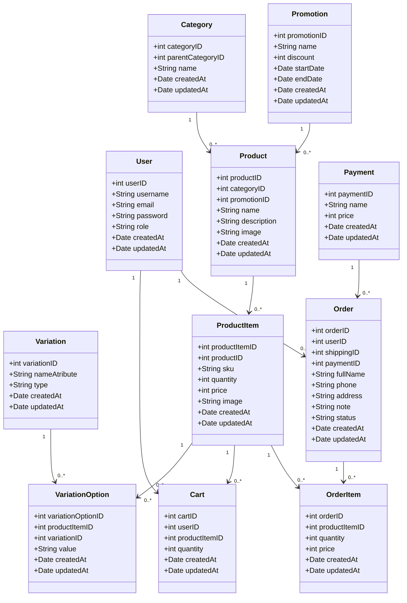

## Class Diagram

## Database Schema

### Users Table

| Stt | Tên thuộc tính | Kiểu dữ liệu  | Ràng buộc                           | Mô tả                                    |
| --- | -------------- | ------------- | ----------------------------------- | ---------------------------------------- |
| 1   | userID         | INT           | PRIMARY KEY, IDENTITY(1, 1)         | Unique identifier for each user          |
| 2   | username       | NVARCHAR(255) |                                     | Username of the user                     |
| 3   | email          | VARCHAR(255)  | UNIQUE, NOT NULL                    | Email address of the user                |
| 4   | password       | NVARCHAR(255) | NOT NULL                            | Password of the user                     |
| 5   | role           | VARCHAR(255)  | DEFAULT 'client'                    | Role of the user                         |
| 6   | createdAt      | DATETIME      | DEFAULT CURRENT_TIMESTAMP, NOT NULL | Timestamp when the user was created      |
| 7   | updatedAt      | DATETIME      |                                     | Timestamp when the user was last updated |

### Categories Table

| Stt | Tên thuộc tính   | Kiểu dữ liệu  | Ràng buộc                           | Mô tả                                        |
| --- | ---------------- | ------------- | ----------------------------------- | -------------------------------------------- |
| 1   | categoryID       | INT           | PRIMARY KEY, IDENTITY(1, 1)         | Unique identifier for each category          |
| 2   | parentCategoryID | INT           |                                     | Identifier for the parent category           |
| 3   | name             | NVARCHAR(255) | UNIQUE, NOT NULL                    | Name of the category                         |
| 4   | createdAt        | DATETIME      | DEFAULT CURRENT_TIMESTAMP, NOT NULL | Timestamp when the category was created      |
| 5   | updatedAt        | DATETIME      |                                     | Timestamp when the category was last updated |

### Promotions Table

| Stt | Tên thuộc tính | Kiểu dữ liệu  | Ràng buộc                                 | Mô tả                                         |
| --- | -------------- | ------------- | ----------------------------------------- | --------------------------------------------- |
| 1   | promotionID    | INT           | PRIMARY KEY, IDENTITY(1, 1)               | Unique identifier for each promotion          |
| 2   | name           | NVARCHAR(255) | DEFAULT 'normal'                          | Name of the promotion                         |
| 3   | discount       | TINYINT       | CHECK (discount >= 0 AND discount <= 100) | Discount percentage                           |
| 4   | startDate      | DATE          | NOT NULL                                  | Start date of the promotion                   |
| 5   | endDate        | DATE          |                                           | End date of the promotion                     |
| 6   | createdAt      | DATETIME      | DEFAULT CURRENT_TIMESTAMP, NOT NULL       | Timestamp when the promotion was created      |
| 7   | updatedAt      | DATETIME      |                                           | Timestamp when the promotion was last updated |

### Variations Table

| Stt | Tên thuộc tính | Kiểu dữ liệu  | Ràng buộc                           | Mô tả                                         |
| --- | -------------- | ------------- | ----------------------------------- | --------------------------------------------- |
| 1   | variationID    | INT           | PRIMARY KEY, IDENTITY(1, 1)         | Unique identifier for each variation          |
| 2   | nameAtribute   | NVARCHAR(255) | UNIQUE, NOT NULL                    | Name of the attribute (e.g., color, size)     |
| 3   | type           | VARCHAR(255)  |                                     | Type of the variation                         |
| 4   | createdAt      | DATETIME      | DEFAULT CURRENT_TIMESTAMP, NOT NULL | Timestamp when the variation was created      |
| 5   | updatedAt      | DATETIME      |                                     | Timestamp when the variation was last updated |

### Products Table

| Stt | Tên thuộc tính | Kiểu dữ liệu  | Ràng buộc                           | Mô tả                                       |
| --- | -------------- | ------------- | ----------------------------------- | ------------------------------------------- |
| 1   | productID      | INT           | PRIMARY KEY, IDENTITY(1, 1)         | Unique identifier for each product          |
| 2   | categoryID     | INT           |                                     | Identifier for the category                 |
| 3   | promotionID    | INT           |                                     | Identifier for the promotion                |
| 4   | name           | NVARCHAR(255) | UNIQUE, NOT NULL                    | Name of the product                         |
| 5   | description    | TEXT          |                                     | Description of the product                  |
| 6   | image          | NVARCHAR(255) |                                     | Image URL of the product                    |
| 7   | createdAt      | DATETIME      | DEFAULT CURRENT_TIMESTAMP, NOT NULL | Timestamp when the product was created      |
| 8   | updatedAt      | DATETIME      |                                     | Timestamp when the product was last updated |

### ProductItem Table

| Stt | Tên thuộc tính | Kiểu dữ liệu  | Ràng buộc                                                    | Mô tả                                            |
| --- | -------------- | ------------- | ------------------------------------------------------------ | ------------------------------------------------ |
| 1   | productItemID  | INT           | PRIMARY KEY, IDENTITY(1, 1)                                  | Unique identifier for each product item          |
| 2   | productID      | INT           | FOREIGN KEY REFERENCES products(productID) ON DELETE CASCADE | Identifier for the product                       |
| 3   | sku            | VARCHAR(255)  |                                                              | Stock Keeping Unit                               |
| 4   | quantity       | INT           | NOT NULL, DEFAULT 0, CHECK (quantity >= 0)                   | Quantity of the product item                     |
| 5   | price          | INT           | NOT NULL, DEFAULT 0, CHECK (price >= 0)                      | Price of the product item                        |
| 6   | image          | NVARCHAR(255) |                                                              | Image URL of the product item                    |
| 7   | createdAt      | DATETIME      | DEFAULT CURRENT_TIMESTAMP, NOT NULL                          | Timestamp when the product item was created      |
| 8   | updatedAt      | DATETIME      |                                                              | Timestamp when the product item was last updated |

### VariationOption Table

| Stt | Tên thuộc tính    | Kiểu dữ liệu  | Ràng buộc                                                           | Mô tả                                                |
| --- | ----------------- | ------------- | ------------------------------------------------------------------- | ---------------------------------------------------- |
| 1   | variationOptionID | INT           | PRIMARY KEY, IDENTITY(1, 1)                                         | Unique identifier for each variation option          |
| 2   | productItemID     | INT           | FOREIGN KEY REFERENCES productItem(productItemID) ON DELETE CASCADE | Identifier for the product item                      |
| 3   | variationID       | INT           | FOREIGN KEY REFERENCES variations(variationID) ON DELETE CASCADE    | Identifier for the variation                         |
| 4   | value             | NVARCHAR(255) | NOT NULL                                                            | Value of the variation option (e.g., XL, white)      |
| 5   | createdAt         | DATETIME      | DEFAULT CURRENT_TIMESTAMP, NOT NULL                                 | Timestamp when the variation option was created      |
| 6   | updatedAt         | DATETIME      |                                                                     | Timestamp when the variation option was last updated |

### Carts Table

| Stt | Tên thuộc tính | Kiểu dữ liệu | Ràng buộc                                                           | Mô tả                                    |
| --- | -------------- | ------------ | ------------------------------------------------------------------- | ---------------------------------------- |
| 1   | cartID         | INT          | PRIMARY KEY, IDENTITY(1, 1)                                         | Unique identifier for each cart          |
| 2   | userID         | INT          | FOREIGN KEY REFERENCES users(userID) ON DELETE CASCADE              | Identifier for the user                  |
| 3   | productItemID  | INT          | FOREIGN KEY REFERENCES productItem(productItemID) ON DELETE CASCADE | Identifier for the product item          |
| 4   | quantity       | INT          | NOT NULL, DEFAULT 1, CHECK (quantity >= 1)                          | Quantity of the product item in the cart |
| 5   | createdAt      | DATETIME     | DEFAULT CURRENT_TIMESTAMP, NOT NULL                                 | Timestamp when the cart was created      |
| 6   | updatedAt      | DATETIME     |                                                                     | Timestamp when the cart was last updated |

### Payments Table

| Stt | Tên thuộc tính | Kiểu dữ liệu  | Ràng buộc                               | Mô tả                                              |
| --- | -------------- | ------------- | --------------------------------------- | -------------------------------------------------- |
| 1   | paymentID      | INT           | PRIMARY KEY, IDENTITY(1, 1)             | Unique identifier for each payment                 |
| 2   | name           | NVARCHAR(255) | NOT NULL, UNIQUE                        | Name of the payment method                         |
| 3   | price          | INT           | NOT NULL, DEFAULT 0, CHECK (price >= 0) | Price of the payment method                        |
| 4   | createdAt      | DATETIME      | DEFAULT CURRENT_TIMESTAMP, NOT NULL     | Timestamp when the payment method was created      |
| 5   | updatedAt      | DATETIME      |                                         | Timestamp when the payment method was last updated |

### Orders Table

| Stt | Tên thuộc tính | Kiểu dữ liệu  | Ràng buộc                                               | Mô tả                                     |
| --- | -------------- | ------------- | ------------------------------------------------------- | ----------------------------------------- |
| 1   | orderID        | INT           | PRIMARY KEY, IDENTITY(1, 1)                             | Unique identifier for each order          |
| 2   | userID         | INT           | FOREIGN KEY REFERENCES users(userID) ON DELETE SET NULL | Identifier for the user                   |
| 3   | shippingID     | INT           |                                                         | Identifier for the shipping               |
| 4   | paymentID      | INT           |                                                         | Identifier for the payment method         |
| 5   | fullName       | NVARCHAR(255) | NOT NULL                                                | Full name of the recipient                |
| 6   | phone          | VARCHAR(255)  | NOT NULL                                                | Phone number of the recipient             |
| 7   | address        | NVARCHAR(255) | NOT NULL                                                | Address of the recipient                  |
| 8   | note           | TEXT          |                                                         | Note for the order                        |
| 9   | status         | NVARCHAR(255) | NOT NULL, DEFAULT 'processing'                          | Status of the order                       |
| 10  | createdAt      | DATETIME      | DEFAULT CURRENT_TIMESTAMP, NOT NULL                     | Timestamp when the order was created      |
| 11  | updatedAt      | DATETIME      |                                                         | Timestamp when the order was last updated |

### OrderItem Table

| Stt | Tên thuộc tính | Kiểu dữ liệu | Ràng buộc                                                            | Mô tả                                          |
| --- | -------------- | ------------ | -------------------------------------------------------------------- | ---------------------------------------------- |
| 1   | orderID        | INT          | FOREIGN KEY REFERENCES orders(orderID) ON DELETE CASCADE             | Identifier for the order                       |
| 2   | productItemID  | INT          | FOREIGN KEY REFERENCES productItem(productItemID) ON DELETE SET NULL | Identifier for the product item                |
| 3   | quantity       | INT          | NOT NULL, DEFAULT 0, CHECK (quantity >= 0)                           | Quantity of the product item in the order      |
| 4   | price          | INT          | NOT NULL, DEFAULT 0, CHECK (price >= 0)                              | Price of the product item in the order         |
| 5   | createdAt      | DATETIME     | DEFAULT CURRENT_TIMESTAMP, NOT NULL                                  | Timestamp when the order item was created      |
| 6   | updatedAt      | DATETIME     |                                                                      | Timestamp when the order item was last updated |
